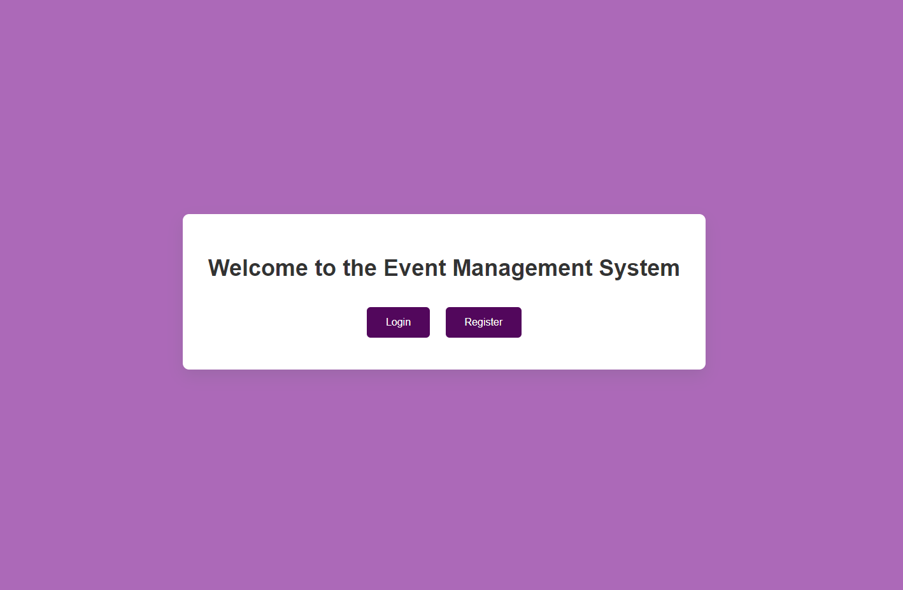
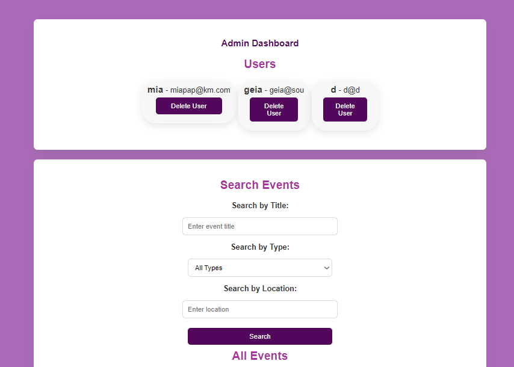
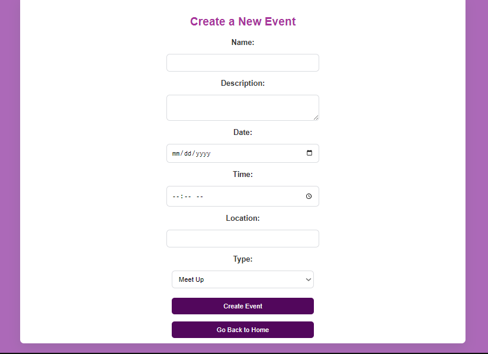
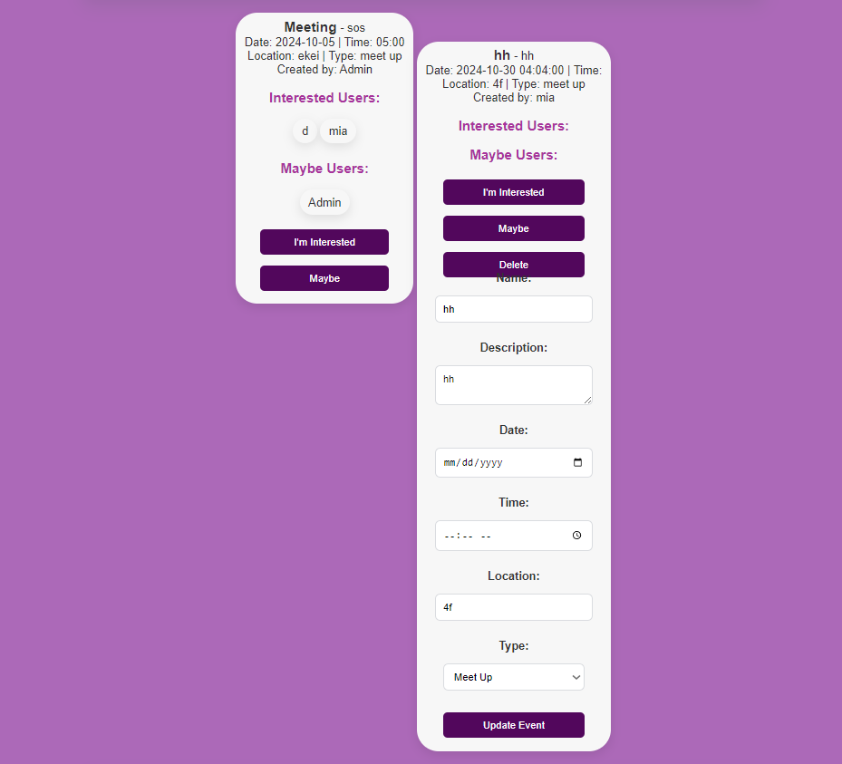
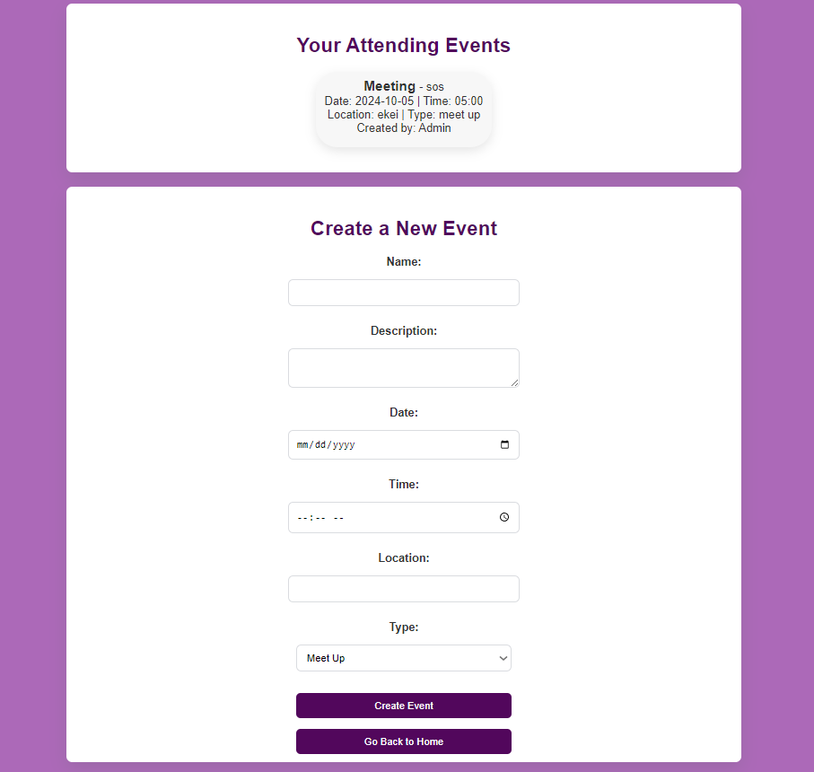
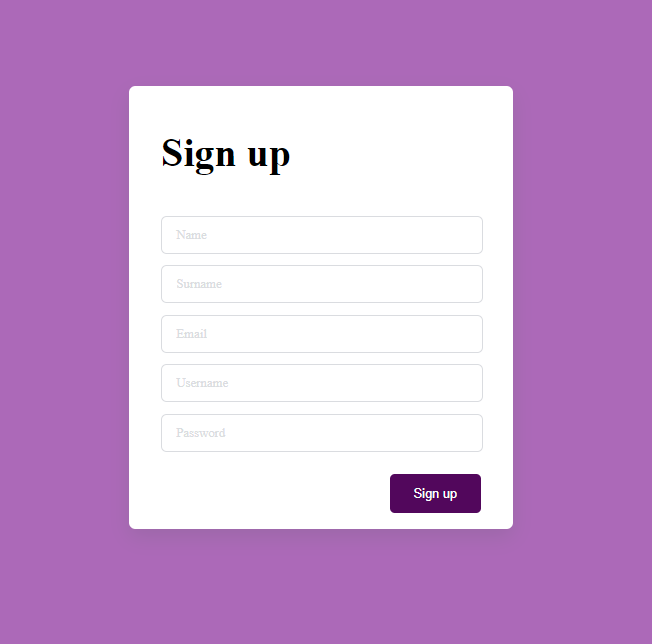

 # Υποχρεωτική Άσκηση Πληροφοριακών Συστημάτων Σεπτεμβρίου 2024
> ΑΜ Ε19243 Ευθυμία Παπαναστασοπούλου

## Περιεχόμενα 
1. Επιπλέον παραδοχές
2. Τεχνολογίες
3. Περιγραφή των αρχείων
4. Τρόπος Εκτέλεσης
5. Τρόπος Χρήσης 
6. Βιβλιογραφία

### 1. Επιπλέον παραδοχές
Για την εργασία χρησιμοποίηθηκαν CSS formats και HTML για την διεπαφή μεταξύ χρήστη (και admin) με το σύστημα. 

### 2. Τεχνολογίες 
- Python
- Flask-PyMongo
- MongoDB
- CSS formats
- HTML
- Docker

### 3. Περιγραφή των αρχείων 
- Ο φάκελος **eventapp** ο οποίος περιλαμβάνει όλα τα files και folders που περιγράφονται παρακάτω, χρησιμοποιείται για την καλύτερη οργάνωση του κωδίκα
- Ο φάκελος **data** περιλαμβάνει όλα τα απαραίτητα δεδομένα όπως ζητήθηκε από την εκφώνηση σε περίπτωση που το container διαγραφεί
- Το **Dockerfile** περιέχει όλα τα απαραίτητα δεδομένα για τη δημιουργία του DOcker Image του Flask application
- Το **Dockerfile.mongo** περιέχει όλες τις απαραίτητες εντολές για την δημιουργία του Docker Image της βάσης δεδομένων MongoDB
- Το **docker-compose.yml** το οποίο έχει τις εντολές οι οποίες εκτελούν την εκκίνηση της Flask application και της βάσης μας.
- Το **app.py** το οποίο είναι το βασικό αρχείο της εφαρμογής μας. Εκεί βρίσκονται όλες οι εντολές οι οποίες υλοποιούν τα διάφορα routes. Πιο συγκεκριμένα :
    * o **admin** ο οποίος μπορεί να κάνει login μέσω του route **Login** το οποίο επιτρέπει σε αυτόν (και τους χρήστες εφόσον έχουν κάνει register) να συνδεθεί στην πλατφόρμα του eventapp στέλνοντας τον στο **admin_dashboard** όπου εκεί μπορεί να πραγματοποιήσει οποιαδήποτε από τις παρακάτω ενέργειες επιθυμεί : 
        1. <ins>Delete User</ins>: η οποία ενέργεια επιτρέπει στον admin να διαγράψει έναν χρήστη από την βάση δεδομένων
        2. <ins>Delete Event</ins>: αυτή η ενέργεια επιτρέπει στον admin να διαγράψει οποιοδήποτε event επιθυμεί
        3. <ins>όλες τις εντολές που μπορεί να κάνει και ένας απλός user</ins>
    * ο **user** μπορεί να κάνει register για να εγγραφεί στο σύστημα μέσω του **Register** route και έπειτα να κάνει login με το username του και το password του. Έπειτα μεταβιβάζεται στο **user_dashboard** όπου εκεί πέρα με την σειρά του μπορέι να εκτελέσει τις παρακάτω ενέργειες :
        1. <ins>Search Events</ins>: ο χρήστης μπορεί να αναζητήσει οποιοδήποτε event, και επίσης μπορεί να δει όλα τα events απευθείας 
        2. <ins>Create Event</ins>: ο χρήστης (και κατεπέκταση ο admin) μπορεί να δημιουργήσει όποιο event επιθυμεί με μόνη προϋπόθεση η ημερομηνία του event να είναι μετά την παρούσα
        3. <ins>Update Event</ins>: ο χρήστης μετά την δημιουργία ενός event κατεπέκταση μπορεί να ενημερώσει το event που έχει φτιάξει ο ίδιος ή μπορεί να το διαγράψει 
- Τέλος το **requiriments.txt** περιλαμβάνει όλες τις βιβλιοθήκες που χρειαστήκαμε για την εφαρμογή.

### 4. Τρόπος εκτέλεσης
Για την εκτέλεση της εφαρμογής θα χρειαστεί : 
- να εγκαταστήσουμε τις βιβλιοθληκες από το requirements.txt 
  ```
  pip install -r requirements.txt
  ```

- με την χρήση του Docker Desktop πρέπει να βεβαιωθούμε ότι η MongoDB βάση μας λειτουργεί. Μπορούμε να χρησιμοποιήσουμε την παρακάτω εντολή στο cmd επίσης για μεγαλύτερη ευκολία
  ```
  docker-compose up --build
  ```

  το οποίο θα εκτελέσει τα 2 containers που έχουμε δημιουργήσει 

- έπειτα τρέχουμε το app.py
  ```
  python app.py
  ```

- εφόσον το terminal μας ενημερώνει ότι όλα κυλάνε ομαλά, μπορούμε με την χρήση του Postman να τεστάρουμε την λειτουργικότητα της εφαρμογής μας.

### 5. Τρόπος Χρήσης
Στον τρόπο χρήσης της εφαρμογής με το που εκτελέσουμε την εντολη 
```
python app.py
```
μεταβιβαζόμαστε στην διεύθυνση που αναγράφεται στο λειτουργικό μας και εκέι βρισκόμαστε στην αρχική οθόνη του eventapp



από εκείνο το σημείο έχουμε 2 επιλογές : 
* είτε κάνουμε login ως κάποιος από τους υπαρκτούς users (username : mia, password: mia), είτε ως admin (username: admin, password: admin321)
* είτε κάνουμε register ως κάποιος νέος user 

**Login**


εδώ βάζουμε τα στοιχεία μας και μεταβιβαζόμαστε στο αντίστοιχο dashboard

**Admin Dashboard**




Στο συγκεκριμένο dashboard που ανήκει στον admin παρατηρούμε όλα τα commands που μπορεί να εκτελέσει. Πιο συγκεκριμένα μπορεί να δει όλους τους χρήστες και να διαγράψει όποιον θέλει , μπορεί να ψάξει οποιοδήποτε event επιθυμεί στο search, να δει όλα τα events απευθείας, να διαγράψει οποιοδήποτε event θέλει, να κανει update μονάχα αυτά που έχει δημιουργήσει ο ίδιος και τέλος να κατασκευάσει ένα νέο event. 

**User Dashboard**




Βάζοντας το username και το password του user μεταβιβαζόμαστε στο dashboard του χρήστη και παρατηρούμε ότι μπορεί να εκτελέσει τις ίδιες ενέργειες με τον admin, πλην της διαγραφής άλλων χρηστών και άλλων event. 

Άμα πατήσουμε το κουμπί go back to home και έπειτα πατήσουμε το κουμπί register



μεταβιβαζόμαστε στην φόρμα εγγραφής για τον νέο χρήστη και όταν τα στοιχεία δηλωθούν ο νεός χρήστης είναι έτοιμος να χρησιμοποιήσει το eventapp !
### 6. Βιβλιογραφία 
- Διαφάνειες εργαστηριών
- Youtube 
- StackOverflow
- GeeksForGeeks


